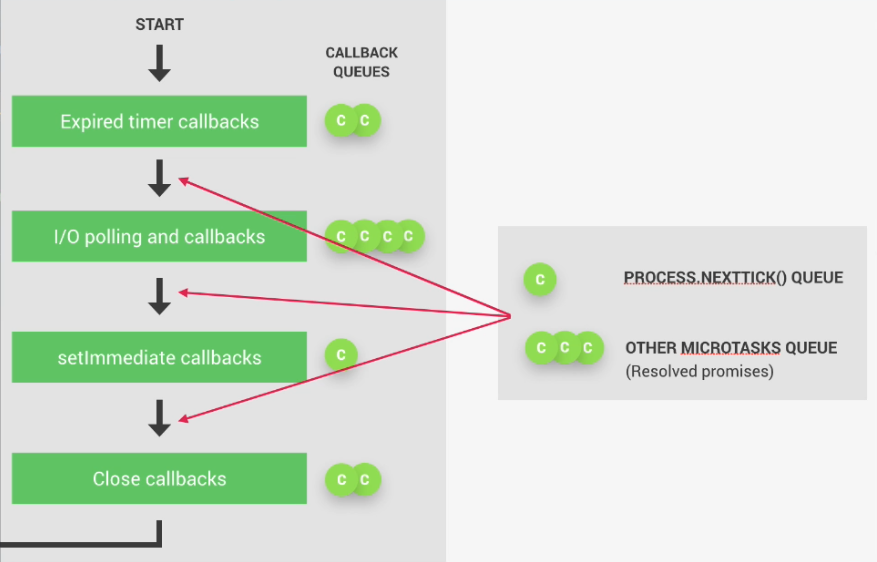
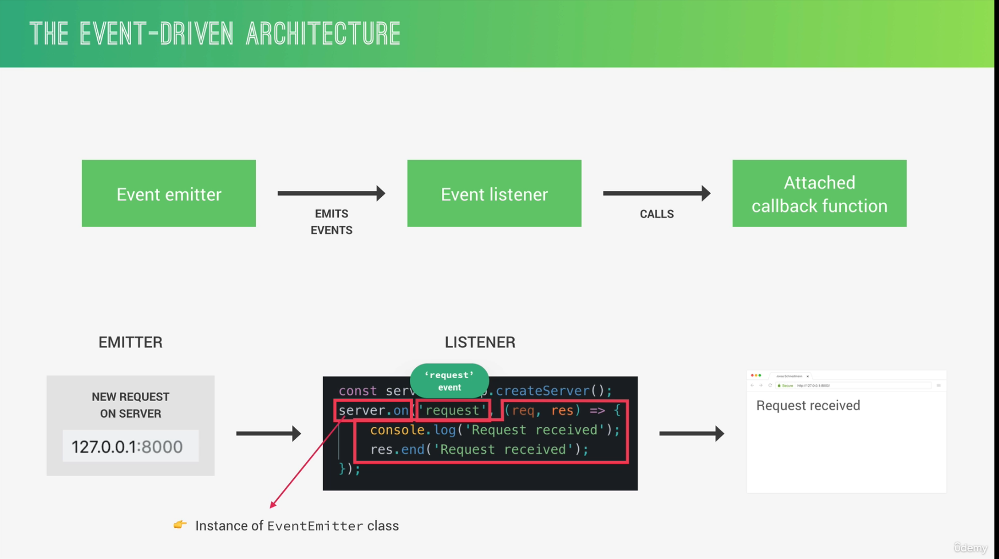
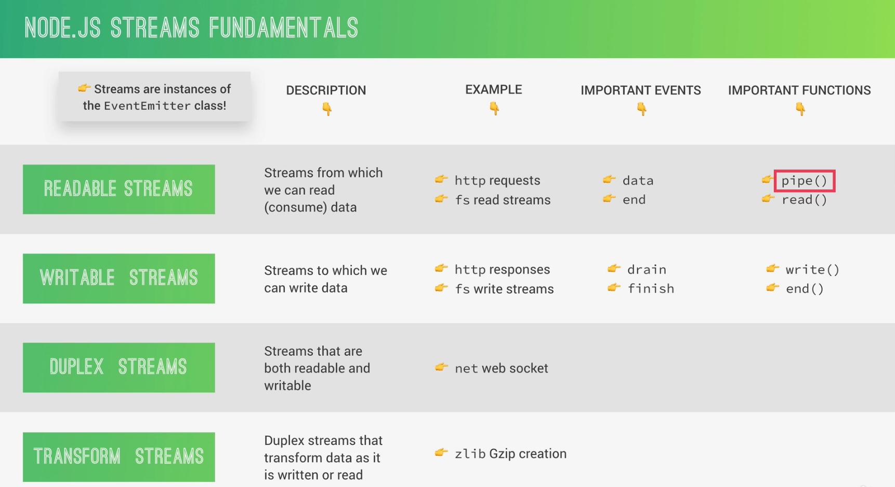
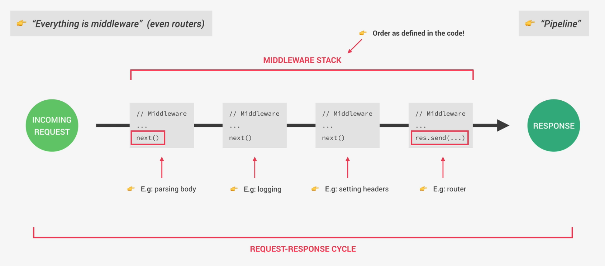
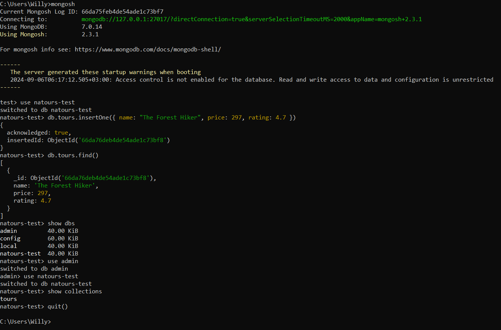
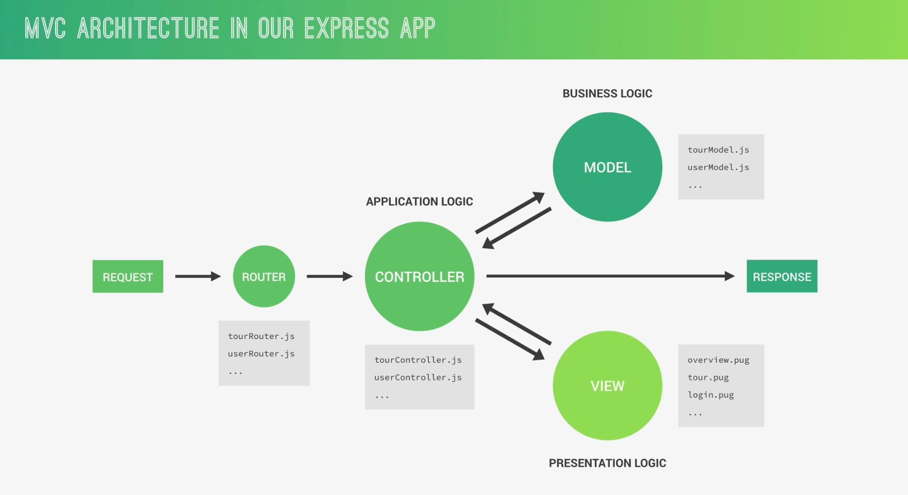
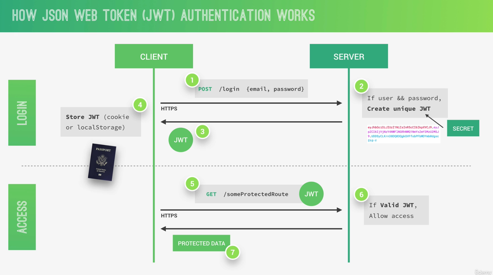
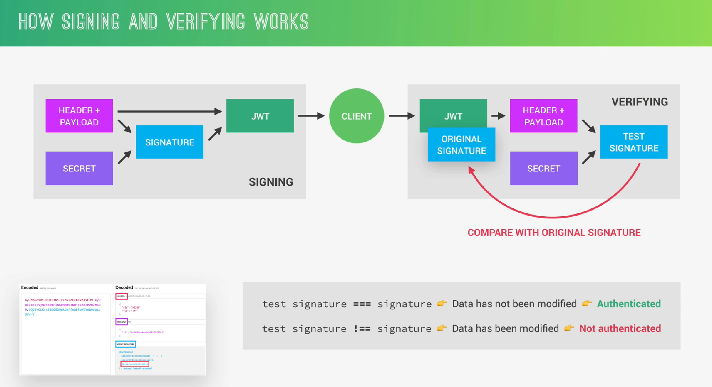

# NodeCourse

Following this course: https://www.udemy.com/course/nodejs-express-mongodb-bootcamp 

Demos: 
1- 

Notes: 
1- Ctrl + ` -> to open terminal 
2- Write {node} to enter the REPL and {Ctrl + D} to Exit 
3- To make a shortcut in terminal {File -> Preferences -> Keyboard Shortcuts} Clear Terminal comand -> workbench.action.terminal.clear 
4- Callback Hell: 
 
5- Use {CTRL + C} to exit the process (Server) 
6- Event Loop: 
 
7- Event Arcitecture: 
 
8- Streams: 
 
9- Backpressure error: When respone can't send data as fast as it is resieving it 
10- POST request used to create new resource 
11- GET request used to read a resource 
12- PUT request used to update all resources 
13- PATCH request used to update a patch from the data 
14- DELETE request used to delete a resource 
15- CRUD are the name of these operations (Create, Read, Update, Delete) 
16-  
17- MongoDB uses BSON encoding 
18- Mongo Shell Testing: (insertMany is like insertOne but takes more then one object) 
 
19- db.tours.find({ name: "The Forest Hiker"}) -> To filter by name, can be anything 
20- db.tours.find({price: {$lte: 500}}) -> $lte stands for less than or equal and $ symbol is reserved by mongo 
    * $lt stands for less than 
    * $gt stand for greater than 
21- find( {First Condition}, {Second Condition} ) -> AND operator 
22- find( {$or: [ {First Condition}, {Second Condition} ]} ) -> OR operator 
23- db.tours.updateOne({ rating: 4.8 }, { $set: {price: 597}}) -> Update the object with rating 4.8 if more then one object have the same condition it will update the first only updateMany is used to update all the ones that match the condition 
24- To completly replace use replaceOne or replaceMany 
25- To delete we use deleteMany or deleteOne 
26- db.tours.deleteMany({}) to delete all the objects 
27- MVC Architecture: Model (Business logic layer) - Controller (Application Logic Layer) - View Layer 
 
28- JWT Lojic 
 
 
