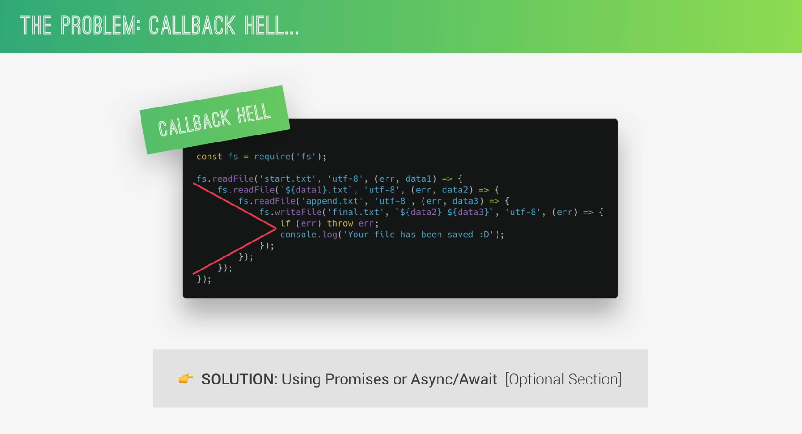

# NodeCourse
Following this course: https://www.udemy.com/course/nodejs-express-mongodb-bootcamp

Demos:
    1- 

Notes:
    1- Ctrl + ` -> to open terminal
    2- Write {node} to enter the REPL and {Ctrl + D} to Exit
    3- To make a shortcut in terminal {File -> Preferences -> Keyboard Shortcuts} Clear Terminal comand -> workbench.action.terminal.clear
    4- Callback Hell 
    5- Use {CTRL + C} to exit the process (Server)